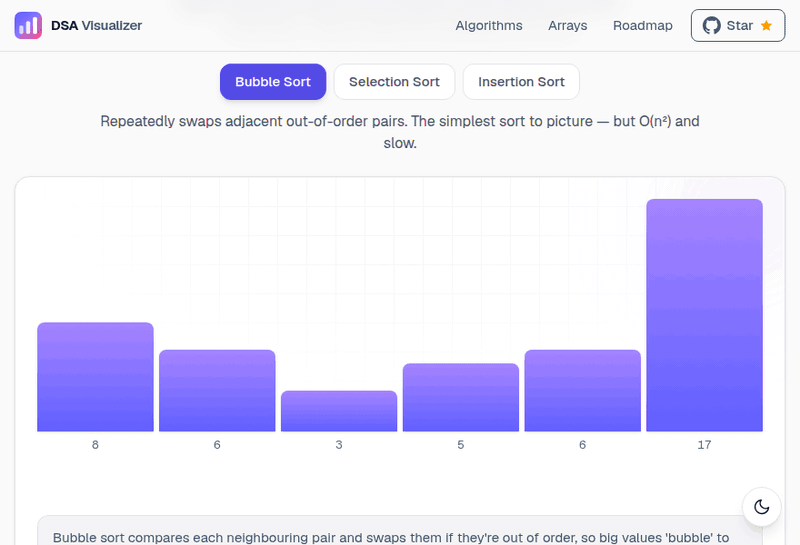

<p align="center">
  
</p>

<p align="center">
  <strong>See data structures and algorithms work, one step at a time.</strong><br />
  Press play, watch the bars move, follow the highlighted pseudocode and the live loop variables. Free, no sign-up, runs in your browser.
</p>

<p align="center">
  <a href="https://visualizer-gold.vercel.app"><strong>▶ Open the live demo</strong></a>
</p>

<p align="center">
  <a href="https://github.com/salsadsid/visualizer/actions/workflows/ci.yml"></a>
  <a href="LICENSE"></a>
  <a href="CONTRIBUTING.md"></a>
  <a href="https://github.com/salsadsid/visualizer/stargazers"></a>
</p>

<p align="center">
  <a href="https://visualizer-gold.vercel.app/algorithms/sorting/bubble-sort">
    
  </a>
</p>

If this helps you learn or teach, a ⭐ helps other students find it.

## What's inside

| Tool | What you can do | Try it |
| --- | --- | --- |
| **Big-O Playground** | Start from zero: a short story, count steps together with the computer, then watch O(1) … O(2ⁿ) curves pull apart on a live chart | [Open](https://visualizer-gold.vercel.app/algorithms/complexity) |
| **Sorting Visualizer** | Compare Bubble, Selection and Insertion sort, then step through each on its own page. Your list travels with you when you switch | [Overview](https://visualizer-gold.vercel.app/algorithms/sorting) · [Bubble](https://visualizer-gold.vercel.app/algorithms/sorting/bubble-sort) · [Selection](https://visualizer-gold.vercel.app/algorithms/sorting/selection-sort) · [Insertion](https://visualizer-gold.vercel.app/algorithms/sorting/insertion-sort) |
| **1D Array Visualizer** | Insert, delete, linear search and reverse with two pointers, animated one read and write at a time, with live indices, counters and code in four languages | [Open](https://visualizer-gold.vercel.app/data-structures/arrays/1d) |
| **2D Array Visualizer** | Paste any 2D array or matrix (JSON, a Python list, or plain rows of numbers) and see it as a grid. Colour cells by value, show row and column indices, and share the result as a link | [Open](https://visualizer-gold.vercel.app/data-structures/arrays) |
| **Grid Traversals** | Six ways to walk a 2D array, row-major, column-major, snake, diagonal, boundary and spiral, each with live indices, a visit number on every cell, the output sequence and code | [Overview](https://visualizer-gold.vercel.app/data-structures/arrays/traversal) · [Spiral](https://visualizer-gold.vercel.app/data-structures/arrays/traversal/spiral) |
| **Matrix Operations** | Transpose, rotate 90°, flip and multiply a matrix one cell at a time, with the source and the result side by side, live indices, counters and code in four languages | [Overview](https://visualizer-gold.vercel.app/data-structures/arrays/matrix) · [Multiply](https://visualizer-gold.vercel.app/data-structures/arrays/matrix/multiply) |
| **Grid Algorithms** | Flood fill (BFS and DFS), number of islands and BFS shortest path in a maze, with the queue or call stack drawn live, distances on every cell and clickable grids | [Overview](https://visualizer-gold.vercel.app/algorithms/grid) · [Shortest path](https://visualizer-gold.vercel.app/algorithms/grid/shortest-path) |

Every sorting page has:

- **Play / pause / step / scrub** controls and a 0.5×–4× speed dial (plus `Space` and `←` / `→`)
- **Synchronized pseudocode**: the active line highlights as it runs
- **Live variables on the board**: pointer markers (`i`, `j`, `min`) under the bars and value chips (`key`, `swapped`)
- A plain-English **narration** line and live **comparison / swap / write** counters
- Presets (random, reversed, nearly sorted, few unique, sorted), a size slider, shuffle and custom input
- **Copy link to this step**: a URL that reopens the same array at the same moment, handy for classes and bug reports
- A written explainer with a worked example, common beginner mistakes and an FAQ
- Code in **C++, Python, JavaScript and TypeScript**

Light and dark themes, works on a 320 px phone, and honours `prefers-reduced-motion`.

## Why it's built this way

- **One tiny step-trace engine, no chart or animation library.** An algorithm is a plain function that records a list of snapshots. One `usePlayer` hook plays, pauses, steps and scrubs through that list, and shared components draw it. The bars are `div`s.
- **Pure by construction.** The strict React Compiler lint rules are on (no `setState` in effects, no ref writes or impure calls during render), and CI runs lint, tests and a production build on every pull request.
- **Tested logic.** The sorting engine, both input parsers and the page catalog are covered with `node:test`, with zero test dependencies.
- **Fast and accessible.** Statically generated pages; Lighthouse (mobile) scores 94–95 performance, 100 accessibility and 100 SEO on the tool pages.

```js
Step = {
  array,        // the working array at this moment
  highlights,   // which bars are comparing / swapping / sorted …
  pointers,     // index variables (i, j, min) drawn under the bars
  vars,         // scalar variables (key, swapped) shown as chips
  line,         // the active pseudocode line
  message,      // the narration text
  stats,        // cumulative { comparisons, swaps, writes }
}
```

## Quick start

```bash
git clone https://github.com/salsadsid/visualizer.git
cd visualizer
npm install
npm run dev        # http://localhost:3000
```

```bash
npm run lint       # ESLint, including the strict React hooks rules
npm test           # node:test, no extra dependencies
npm run build      # production build
```

Needs Node 22 or newer (the test script uses `node --test` with a glob). There is no backend, database or API key. Analytics only load when `NEXT_PUBLIC_GA_ID` is set (see `.env.example`).

## Add an algorithm

A new sort is a plain function in `src/lib/algorithms/sorting.js` that mutates a copy of the array and records a step whenever something worth showing happens:

```js
function mySort(values) {
    const a = values.slice();
    const r = makeRecorder(a);

    r.pointers.j = 0;
    r.stats.comparisons++;
    r.push(3, `Compare ${a[0]} and ${a[1]}.`, { 0: "compare", 1: "compare" });

    [a[0], a[1]] = [a[1], a[0]];
    r.stats.swaps++;
    r.push(4, "Swapped them.", { 0: "swap", 1: "swap" });

    r.lockAll();
    r.push(6, "Sorted!");
    return { steps: r.steps };
}
```

The player, bars, pseudocode highlighting, counters and keyboard shortcuts come for free. [CONTRIBUTING.md](CONTRIBUTING.md) has the full checklist, the project structure and the lint rules that trip people up. Looking for somewhere to start? Try the [good first issues](https://github.com/salsadsid/visualizer/labels/good%20first%20issue).

## Roadmap

Next up: **counting sort and frequency arrays**, then merge sort, quick sort, binary search and the core array techniques (prefix sums, two pointers, sliding window). The full list lives on the [roadmap page](https://visualizer-gold.vercel.app/roadmap). Want something sooner? [Open an issue](https://github.com/salsadsid/visualizer/issues/new/choose).

## The story so far

I built this while learning DSA myself, because the tools I found either animated too fast to follow or hid the code. Some things I'm happy with:

- The 2D Array Visualizer ranks **#1 on Google for "2d array visualizer"** (Search Console, September 2026) and has been used by visitors in seven countries.
- Every algorithm plugs into the same zero-dependency step-trace engine, so a new visualizer is mostly writing the algorithm and explaining it well.
- Each release is measured: a private checklist crawls every page for metadata, structured data and phone-width overflow before it ships.

## Tech stack

| Layer     | Tools                                      |
| --------- | ------------------------------------------ |
| Framework | Next.js 16 (App Router) · React 19         |
| Styling   | Tailwind CSS 4 · CSS variables for theming |
| Fonts     | Geist Sans + Geist Mono via `next/font`    |
| Utilities | `clsx`, `tailwind-merge`                    |
| Linting   | ESLint 9 (`eslint-config-next`)            |

No backend, no database — it runs entirely in the browser.

## License

[MIT](LICENSE). Fork it, learn from it, use it in your class.

---

Built by [Salman Sadik Siddiquee](https://github.com/salsadsid) · [Live site](https://visualizer-gold.vercel.app) · [Report a problem](https://github.com/salsadsid/visualizer/issues/new/choose)
